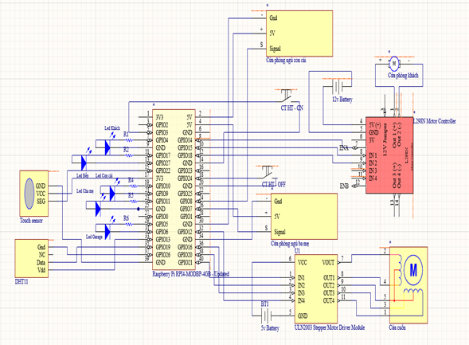
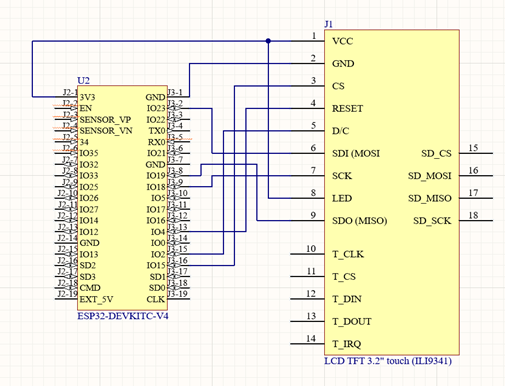

# PBL05_smart_home_with_voice_print

PBL05_smart_home_with_voice_print_and_antifraud_ai is a PBL project for controlling smart house using voice.

## Introduction

Currently, smart home systems combined with identity and access management are thriving, from platforms like Amazon Alexa, Google Home to Bkav SmartHome. These systems integrate device control and access management, allowing role-based access control. However, the biggest drawback of these systems is the cost. Specifically, the setup and maintenance costs are high due to the requirement for specialized hardware such as smart locks, sensors, and central controllers, which are expensive and difficult to integrate with devices from other providers. The control software also needs to be complex and frequently updated, leading to increased development and maintenance costs. System configuration and access management require high technical skills, posing challenges for non-technical users and increasing costs for technical support. Additionally, regular maintenance and system upgrades to ensure compatibility and security further escalate costs. Therefore, our team is undertaking this project to achieve better performance at a lower cost.

## Clone this repository

```bash
git clone https://github.com/tranductri2003/PBL05_smart_home_with_voice_print
```

## Backend

#### Step 0: Prepare

- Use Python==3.11

#### Step 1: Open a new command prompt at the project root directory

#### Step 2: Move to the folder 'BackEnd'

```bash
cd BackEnd
```

#### Step 3: Create Virtual Enviroment

```bash
python -m venv <backend-enviroment-name>
```
or
```bash
python3 -m venv <backend-enviroment-name>
```

#### Step 4: Activate BackEnd Enviroment

* Windows:
```bash
<backend-enviroment-name>\Scripts\activate
```
* Linux:
```bash
<backend-enviroment-name>\Scripts\Activate.ps1
```

#### Step 5: Install dependencies

```bash
python -m pip install -r requirements.txt
```
or
```bash
python3 -m pip install -r requirements.txt
```
#### Step 6: Add .env file and saved model file

#### Step 7: Migrate Database

```bash
python manage.py migrate
```
or
```bash
python3 manage.py migrate
```

#### Step 8: Run Server

```bash
python manage.py runserver 0.0.0.0:8000
```
or
```bash
python3 manage.py runserver 0.0.0.0:8000
```

## IOT

#### Step 0: Prepare

- Use Python==3.11
- Devices: 

| No. | Device                                              | Quantity |
|----:|-----------------------------------------------------|----------|
|    1| Raspberry Pi 4                                      |         1|
|    2| Microphone BOYA M1                                  |         1|
|    3| Wifi Module BLE ESP32 CP2102 NodeMCU LuaNode32      |         1|
|    4| LCD TFT Touch Screen 3.2 Inch ILI9341 SPI Interface |         1|
|    5| Module L298N                                        |         1|
|    6| DC Motor                                            |         1|
|    7| Touch Sensor                                        |         1|
|    8| Limit Switch                                        |         2|
|    9| DHT11 Sensor                                        |         1|
|   10| Steper Motor 28BYJ48-5V                             |         1|
|   11| Steper Motor Driver ULN2003                         |         1|
|   12| Led                                                 |        20|
|   13| Mica                                                |          |

- Raspberry Pi 4 Diagram:



- ESP32 Diagram:



#### Step 1: Open a new command prompt at the project root directory

#### Step 2: Move to the folder 'IOT'

```bash
cd IOT
```

#### Step 3: Create Virtual Enviroment

```bash
python -m venv <iot-enviroment-name>
```
or
```bash
python3 -m venv <iot-enviroment-name>
```

#### Step 4: Activate IOT Enviroment

* Windows:
```bash
<iot-enviroment-name>\Scripts\activate
```
* Linux:
```bash
<iot-enviroment-name>\Scripts\Activate.ps1
```

#### Step 5: Install dependencies

```bash
python -m pip install -r requirements.txt
```
or
```bash
python3 -m pip install -r requirements.txt
```

#### Step 6: Add .env file and saved model file

#### Step 7: Run App

```bash
python main.py
```
or
```bash
python3 main.py
```

## How to train AI model

#### Step 0: Prepare

- Use Python==3.11
- Download and extract train dataset [LibriSpeech train-clean-360.tar.gz](https://www.openslr.org/12)
- Download and extract test dataset [LibriSpeech test-clean.tar.gz](https://www.openslr.org/12)

#### Step 1: Open a new command prompt at the project root directory

#### Step 2: Move to the folder 'AI Module\speaker_recognition_using_lstm'

```bash
cd "AI Module\speaker_recognition_using_lstm"
```

#### Step 3: Create Virtual Enviroment

```bash
python -m venv <ai-enviroment-name>
```
or
```bash
python3 -m venv <ai-enviroment-name>
```

#### Step 4: Activate BackEnd Enviroment

* Windows:
```bash
<ai-enviroment-name>\Scripts\activate
```
* Linux:
```bash
<ai-enviroment-name>\Scripts\Activate.ps1
```

#### Step 5: Install dependencies

```bash
python -m pip install -r requirements.txt
```
or
```bash
python3 -m pip install -r requirements.txt
```

#### Step 6: Change the train and test dataset directories

- Open file "AI Module\speaker_recognition_using_lstm\myconfig.py"
- Find TRAIN_DATA_DIR and change the directory to your train dataset directory
- Find TEST_DATA_DIR and change the directory to your test dataset directory

#### Step 7: Change the training options (Optional)

- Open file "AI Module\speaker_recognition_using_lstm\myconfig.py"
- Change the training options you want to change

## Contributing

Contributions are what make the open-source community such an amazing place to learn, inspire, and create. Any contributions you make are greatly appreciated.

If you have a suggestion that would make this better, please fork the repo and create a pull request. You can also simply open an issue with the tag "enhancement". Don't forget to give the project a star! Thanks again!

1. Fork the Project
2. Create your Feature Branch (`git checkout -b feature/AmazingFeature`)
3. Commit your Changes (`git commit -m 'Add some AmazingFeature'`)
4. Push to the Branch (`git push origin feature/AmazingFeature`)
5. Open a Pull Request

## Feedback

Your feedback is highly appreciated. If you have any suggestions or encounter any issues while using the solver, feel free to reach out to me.

### Contact with Team
- **Github:**

  - [tranductri2003](https://github.com/tranductri2003)

  - [lea.tuan021211](https://github.com/leatuan021211)

  - [Phạm Nguyễn Anh Phát](https://github.com/phatdtvdvt)

  - [Lê Văn Tiến Đạt](https://github.com/levantiendat)

- **Facebook:**:
  
  - [Trần Đức Trí](https://www.facebook.com/tranductri2003/)

  - [Lê Anh Tuấn](https://www.facebook.com/lea.tuan02/)

  - [Phạm Nguyễn Anh Phát](https://www.facebook.com/phamnguyenanhphat)

  - [Lê Văn Tiến Đạt](https://www.facebook.com/levantiendat.2k3)

- **LinkedIn:**

  - [Duc Tri Tran](https://www.linkedin.com/in/duc-tri-tran-464343218/)

  - [Lê Anh Tuấn](https://www.linkedin.com/in/leatuan021211/)

  - [Phạm Nguyễn Anh Phát](https://www.linkedin.com/in/phat-pham-327aa1220/)

  - [Lê Văn Tiến Đạt](https://www.linkedin.com/in/ti%E1%BA%BFn-%C4%91%E1%BA%A1t-l%C3%AA-v%C4%83n-281859176/)
